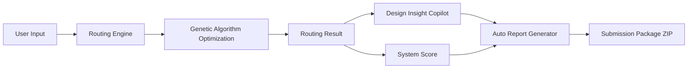
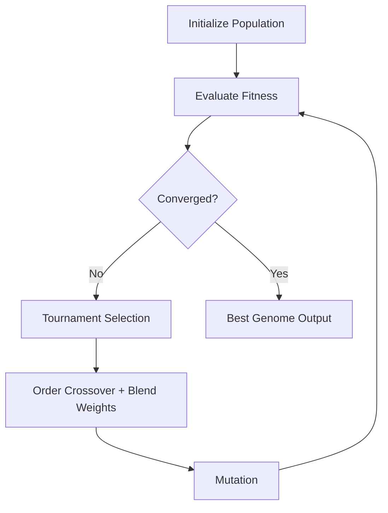
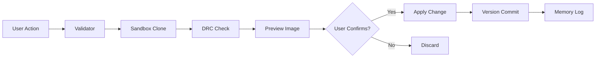
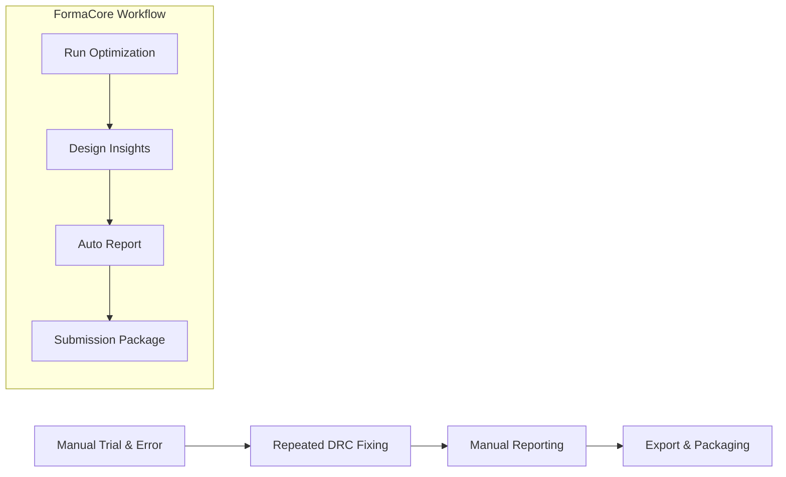

# FormaCore AI

> **Hardware Workflow Copilot for Students & Researchers**

FormaCore reimagines the PCB design workflow by combining AI optimization, explainable routing, automated documentation, and safe interactive editing into a single private, local-first system.

**Time saved on busywork = time earned for deep work.**

---

## The Problem

PCB design is full of workflow friction:

* Trial-and-error routing with no structured feedback
* Manual DRC fixing after every change
* Repetitive export and documentation tasks
* Thermal guessing instead of analysis
* No version history for design decisions
* Hours spent writing lab reports from raw data

Most tools optimize traces.
Few optimize the workflow.

FormaCore eliminates this friction.

---

## Vision

FormaCore is not just a routing engine.
It is a **hardware workflow copilot** that:

* Optimizes routing strategy using evolutionary AI
* Converts raw metrics into actionable insights
* Automates documentation and packaging
* Enables safe, preview-first board editing
* Captures tacit project knowledge automatically

All running fully locally.

---

# Core Capabilities

---

## Routing Engine

* **A* Pathfinding** on 2-layer grids (Manhattan movement + via transitions)
* **Genetic Algorithm Optimization** of:

  * Net ordering (permutation)
  * Cost weights (distance, bend, via, heat, congestion)
* **Thermal-Aware Routing** via Gaussian heat spread model
* **Congestion Tracking** to prevent trace clustering
* **Early Stopping GA** for runtime efficiency

---

## Workflow Intelligence

### Design Insight Copilot

Rule-based analysis converts routing results into human-readable insights:

* Via clustering detection
* Thermal proximity warnings
* Congestion hotspots
* Net length outliers
* Layer imbalance
* Bend ratio analysis
* GA convergence diagnostics
* Component spacing alerts

---

### Auto Report Generator

One-click export of:

* Markdown report
* Plain text report
* Routing comparison
* GA convergence summary
* System score breakdown
* Design insights

---

### Project Memory Log

Automatic knowledge capture:

* Optimization runs
* Assistant actions
* Parameter changes
* DRC results
* Timestamps

Turns design experimentation into structured learning.

---

### Submission Package Automation

One button generates a complete ZIP:

* `report.md`
* `report.txt`
* `naive_routing.png`
* `ga_routing.png`
* `traces.csv`
* `metrics.json`
* `insights.json`
* `timeline.json`

No manual export checklist required.

---

## Interactive Board Assistant

* 11 structured board actions
* Strict schema validation
* Sandbox preview before apply
* Automatic DRC checks
* Undo / Redo with version history
* Full action logging

Nothing modifies the real board without confirmation.

---

## System Score

0–100 weighted score based on:

* Completion rate (35%)
* Via efficiency (20%)
* Trace quality (20%)
* Bend quality (10%)
* Runtime efficiency (15%)

Designed for explainability, not black-box scoring.

---

## Privacy

FormaCore runs fully locally.
No board data leaves the user’s system.

---

# Architecture

```
FormaCore/
├── main.py
├── core/
├── router/
├── ai/
├── visualize/
├── executor/
├── assistant/
├── controller/
├── workflow/
└── ui/
```

---

# System Architecture Flow



---

# Genetic Algorithm Optimization Flow



---

# Assistant Safety Pipeline



---

# Workflow Transformation



---

# Installation

```bash
python -m venv .venv
.venv\Scripts\activate          # Windows
# source .venv/bin/activate     # macOS/Linux

pip install numpy matplotlib streamlit plotly pandas
```

**Requirements:** Python 3.10+

---

# Usage

## Launch Dashboard

```bash
streamlit run FormaCore/ui/app.py
```

---

## Dashboard Tabs

| Tab                  | Purpose                                      |
| -------------------- | -------------------------------------------- |
| PCB Comparison       | Side-by-side naive vs GA routing             |
| Optimization Details | Fitness convergence, net table, weight radar |
| System Score         | 0–100 breakdown                              |
| Export & Reports     | Download images, reports, ZIP                |
| Assistant            | Interactive board editing                    |
| Design Copilot       | Actionable routing insights                  |
| Project Timeline     | Chronological design memory                  |

---

## Typical Workflow

### Optimize & Export

1. Select board and GA parameters
2. Run optimization
3. Review comparison and system score
4. Check Design Copilot insights
5. Click **Prepare Submission Package**
6. Download complete ZIP

---

### Interactive Editing

1. Open Assistant tab
2. Choose structured action
3. Click Preview
4. Review DRC + image
5. Click Apply
6. All changes logged in Project Timeline

---

# Example Result

Naive:

* Completion: 93%
* Vias: 13
* Trace Length: 553

GA Optimized:

* Completion: 100%
* Vias: 7
* Trace Length: 579
* 46% via reduction

---
